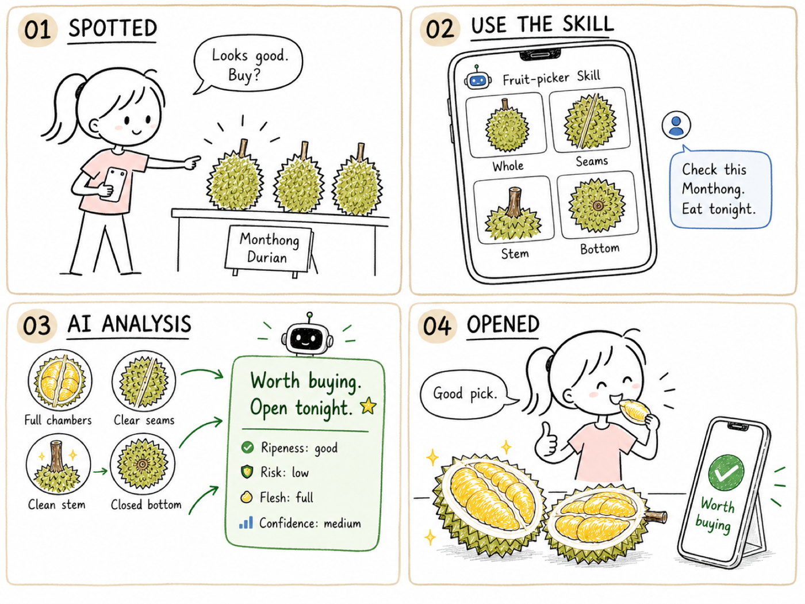

<div align="center">


# 摊主大人 Skill

### *让 AI 帮你 “专业地” 挑水果*

  


🍈 金枕榴莲　👑 猫山王 / D24 / 黑刺　🥭 芒果　🥑 牛油果　🍉 西瓜

[English](README.md) ・ **简体中文**



</div>

---

## 🚀 快速开始

**最省事的方式——把仓库地址丢给你的 Agent:**

```text
帮我装一下这个 skill：https://github.com/Ezra-Y/fruit-picker
```

它会自己取下来放到该放的位置，你什么都不用管。

<details open>
<summary><b>想自己动手？还有三种方式</b></summary>

**当插件装**（能自动更新，所有项目都可用）：

```text
/plugin marketplace add Ezra-Y/fruit-picker
/plugin install fruit-picker@fruit-picker
```

**直接拷文件夹**到你的个人 skills 目录：

```bash
gh repo clone Ezra-Y/fruit-picker /tmp/fruit-picker
cp -R /tmp/fruit-picker/fruit-picker ~/.claude/skills/fruit-picker
```

**跟着项目走**，让团队每个人都有——同样是拷那个文件夹，放进项目里的 `.claude/skills/fruit-picker/`，然后提交。

</details>

装好之后，发张照片给它就行：

```text
帮我看看这颗榴莲，我今晚就想吃。
```

## 🤔 它解决什么问题

榴莲几十块一斤，这颗今晚能不能开？两个西瓜长得差不多，应该拿哪个？芒果颜色很好看，什么时候吃最合适？

**真正难挑的，从来不是一眼就好或一眼就坏的水果，而是那些看着有戏、又让人拿不准的候选。**

摊主大人会检查照片里的果柄、底部、房线、地斑、果肩、开口和损伤等线索，再结合你的食用时间与手感描述，把「拿不准」变成四个明确答案里的一个：

> 🟢 **可以买** ・ 🟡 **满足条件再买** ・ 🔵 **需要确认** ・ 🔴 **换一颗**

## 🍈 一次完整使用

以一颗准备今晚吃的金枕榴莲为例。

### 1️⃣ 一次把信息发全

给同一颗榴莲编号，发四个角度：

| 拍什么 | 拍到位的样子 |
|---|---|
|  **整体照** | 完整轮廓和多个果房 |
|  **刺尖与房线** | 果身中段、果房鼓包位置 |
|  **果柄近照** | 果柄和连接处 |
|  **底部近照** | 底部、开口和异常位置 |

然后一句话调用：

```text
请使用 fruit-picker Skill，帮我看看这颗金枕值不值得买。

我准备今晚吃。照片在商店白光下拍摄。
```
💡 敲黑板！几个重点

**1. 告诉它什么时候吃。** 「今晚吃」和「买回去放两天」，该拿的不是同一颗。

**2. 光线决定颜色能不能用。** 地斑黄不黄、牛油果黑到什么程度、刺尖偏绿还是偏褐——这些颜色判断非常吃光线，所以它会先问你一句「这是在什么光下拍的」。

- ☀️ **最理想**：室外自然散射光。店里光线杂的话，把水果拿到门口或窗边拍一张，效果立刻不一样。
- 💡 **室内白光 / 冷白 LED**：能用，颜色项会按弱证据处理。
- 🏮 **暖黄灯、超市黄灯、混合光**：找张**白纸或小票翻到空白面**，垫在水果旁边一起入镜，它就能校准偏色。手头能找到的参照物按这个顺序挑：灰卡 > 干净白纸 / 白卡 > 小票背面 > 白色纸巾；手机屏幕、金属、玻璃和亮面包装帮不上忙。
- 📵 强阴影、反光、过曝和美颜滤镜会让颜色失真，重拍一张比硬看更省事。

没有白参照也没关系——它会跳过颜色这一项，改用形状、纹路、房线、开口这些不受光线影响的线索，只是结论会更谨慎一点。

**3. 手感自己上手试。** 捏一捏、闻一闻这类信息比照片更有分量，值得你亲自试一下再告诉它；摊主说的「保熟保甜」它不会当作证据。

**4. 一次给全，好过挤牙膏。** 照片、什么时候吃、手感，一条消息里说完，它就能一次给出完整判断，不用来回追问。

### 2️⃣ AI 按证据分析

每张照片各看各的门道：整体照看果房饱不饱满，中段近照看房线、沟槽和刺形，果柄看成熟形态，底部确认开口和关键部位的状态。捏刺、气味和食用时间放在一起，看跟「今晚吃」配不配。

**风险线索永远最先处理。** 

### 3️⃣ 得到明确结论

```text
这颗可以出手，今晚就开。

购买建议：建议买，适合今晚处理
成熟窗口：匹配。房线和沟槽有成熟倾向，相邻刺稍能靠近
风险：关键部位干净，底部闭合
肉量外观：较好。多个果房连续、轮廓比较饱满
置信度：中
```

依据、风险和把握程度一起给你。开完果拍一张，你就知道这次押得准不准 ✅

## 🧺 目前支持

| 水果 | 它帮你 |
|---|---|
| 🍈 **金枕榴莲** | 成熟窗口、开口检查、肉量外观、购买建议 |
| 👑 **猫山王 / D24 / 黑刺** | 品种身份线索、开果验货 |
| 🥭 **芒果** | 软硬和吃法的匹配、后熟潜力 |
| 🥑 **牛油果** | 今天吃还是再等等、切片还是做酱 |
| 🍉 **西瓜** | 同品种、同批次候选里比出更值得拿的那颗 |

更多水果和榴莲品种正在陆续加入 🚧

## 🤔 它凭什么靠谱

**每种水果一张自己的「体检单」**：
金枕重点看果柄、房线、开口和捏刺；西瓜比地斑与果形；芒果看果肩、软硬和吃法；牛油果最信你手掌的感觉。信号全部来自园艺研究、官方标准和采后资料，并且专门为普通手机照片重新整理过。

**证据分轻重**：
关键证据比辅助特征话语权更大。照片模糊、角度不对或光线影响颜色时，对应证据自动降权，缺失的信息保持中性。该补一张照片时，它会直接告诉你拍哪里最值。

**安全永远排第一**：
霉点、腐烂、湿黏、异常软塌和危险开口，一票优先处理。先保你不踩雷，再谈值不值。

**有多大把握，说多大的话**：
每个结论都带高、中、低三档置信度，并说清限制来自照片质量、拍摄覆盖还是信号本身。


## 📄 开源协议

MIT，见 [LICENSE](LICENSE)。


